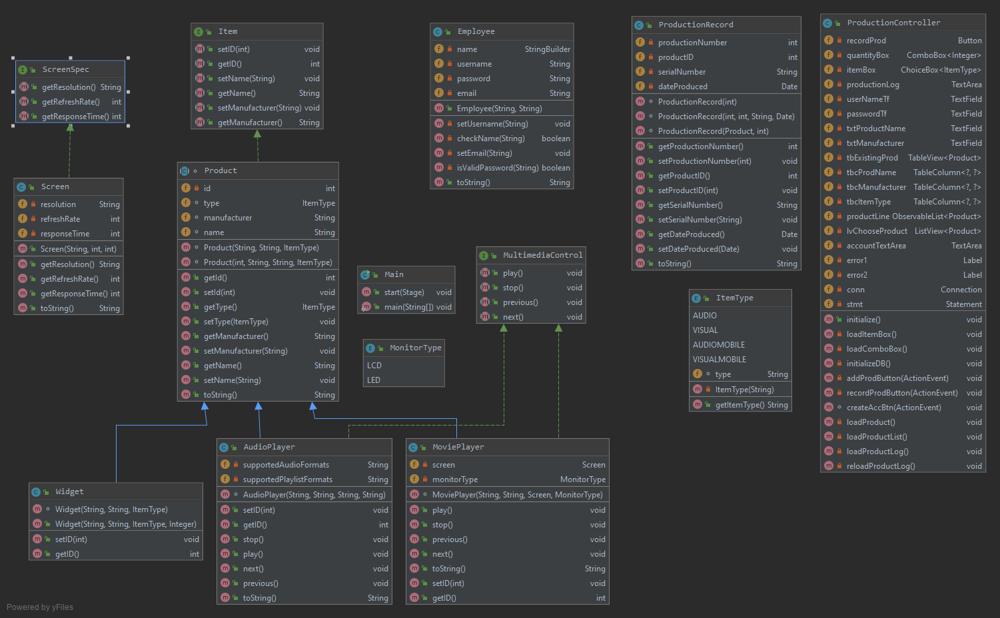
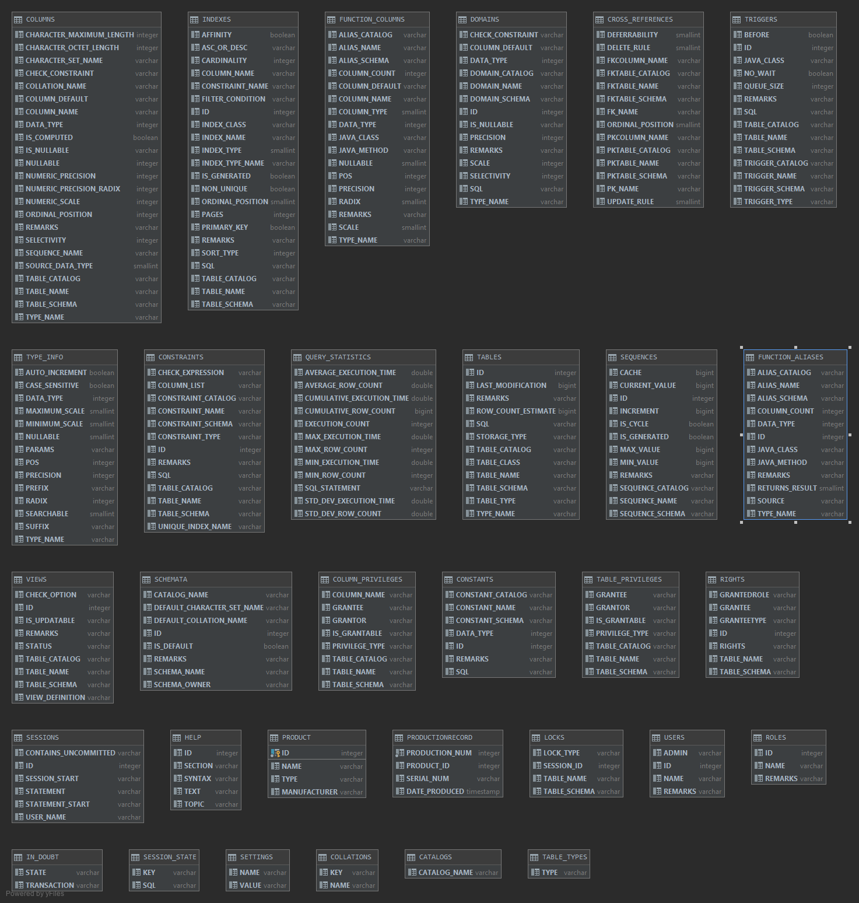

# Product Line Tracker
This program is for a media player production facility that will keep track of what products are produced.

## Demonstration
Connecting GUI with the Database

## Documentation
[JavaDoc]()

 
## Diagrams
**Class Diagram**

**Database Diagram**

## Getting Started

## Built With
**Intellij**

**Scene Builder**
## Contributing

## Author
Louis Sze

## License

## Acknowledgments
1. Professor Scott Vanselow
2. Damian Morgan (TA)
* https://noblecodemonkeys.com/how-to-handle-javafx-button-click-events/
 * https://www.tutorialspoint.com/jdbc/jdbc-insert-records.htm

## History

## Key Programming Concepts Utilized

