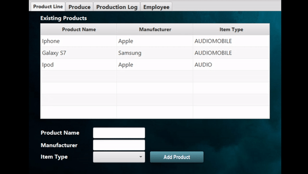
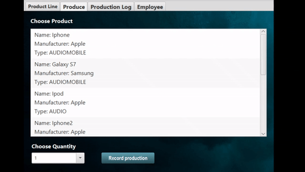
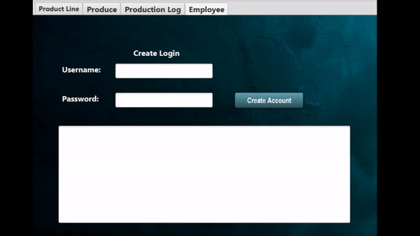
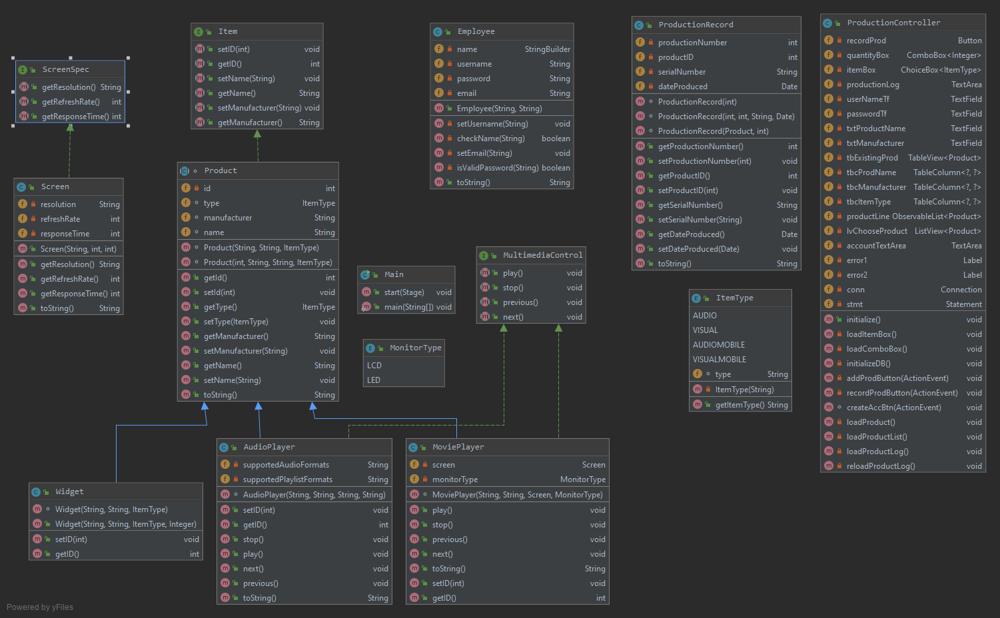

# Product Line Tracker
This program is for a media player production facility that will keep track of what products are produced. 
This program was mostly created individually with assistant from TA as well as Professor.
I started this project on September 16,2019, completed the project on December 7,2019.
I created this project in class and worked on it at home, it was an assignment for Object-Oriented programming
at FGCU.

## Demonstration
**Product Tab:** Creating new Product



**Produce Tab & Production Log:** Produce Amount of Product



**Employee Tab:** Create Login with Full Name and Password




## Documentation
[JavaDoc](https://github.com/Lsze5821/ProductLineOOPFXDB/blob/master/docs/index.html)

 
## Diagrams

**Class Diagram**


**Database Diagram**


## Getting Started
Make sure that JRE is installed:
* Java version "1.8.x_xx" (or a higher version)

Clone from Github:
* Click on "Clone or download".
* Either Download the Zip file or clone the HTTPS.
* If you Download the Zip
* Unzip and open project in the IDE

Clone From IDE:
* File > New > Project From version control > Enter URL/HTTP > Choose the directory for project > clone

Creating Path to Database:
* Database tab > Plus sign > Data source from path > Choose directory for database (ex: Lib Folder) > h2 > test connection > apply
* Check the database password inside the properties folder.

Linking Jar file:
* File > Project structure > Modules > Dependencies > Find and Choose jar file > apply


## Built With
* Intellij

* Scene Builder

* JavaFx GUI, Database H2, SQL
## Contributing

## Author
* Louis Sze

## License
[BSD 3-Clause License](https://github.com/Lsze5821/ProductLineOOPFXDB/blob/master/LICENSE)

## Acknowledgments
1. Professor Scott Vanselow
2. Damian Morgan (TA)
3. Github [Template](https://github.com/PV-COP/PV-README-TEMPLATE/blob/master/TemplateWithInfo.md)
4. Java [Regex](https://regex101.com/)
5. SQL [Syntax](https://www.w3schools.com/sql/sql_syntax.asp)
6. Stack [Overflow](https://stackoverflow.com/)
7. Oracle [Enum](https://docs.oracle.com/javase/tutorial/java/javaOO/enum.html), [Polymorphism](https://docs.oracle.com/javase/tutorial/java/IandI/polymorphism.html), [Interfaces](https://docs.oracle.com/javase/tutorial/java/IandI/createinterface.html), [Combo Box](https://docs.oracle.com/javase/tutorial/uiswing/components/combobox.html)

## History
**Sprint 1 Alpha**

* Week 1
    * Create a JavaFx Project using IntelliJ. 
    * Add project to GitHub, make the repository private.
    * Documentation using a README file.
* Week 2
    * Created a SceneBuilder, using sample.fxml file from JavaFx project.
    * Added a tab view and three tabs called:
        * Product Line
        * Produce
        * Production Log
    * Added a CSS file with personalize codes.
    * Quality Expectations
    * Style Expectations
    * Documentation Expectations
* Week 3

    * Inside the Product Line Tab:
        * Added an AnchorPane.
        * Added to AnchorPane, a 2x3 GridPane.
        * Added to the GridPane: 3 labels(Product Name, Manufacturer, and Item Type), 2 Text Fields, and a ChoiceBox for Item Type.
        * Added a Button that says "Add Product".
        * Added an Event Handler for button click event.
        * Added a Label called Existing Products and a Table View.
    * Inside the Produce Tab:
        * Added an AnchorPane
        * Added 2 Labels(Choose Produce, and Choose Quantity), A List View for Choose Produce, and a ComboBox(returns data type String) for Choose Quantity.
        * Inside the Production Log Tab:
        * Added an AnchorPane.
        * Added a TextArea.
* Week 4

    * Installed database software, add-ons, and imports.
    * Created a res folder.
    * Created a database in the res folder.
    * Connected to the database.
* Week 5

    * Added Database Driver, Database Credentials, Open a Connection, and Execute a Query.
    * Added to the Add Button event handler to add products into the database.
    * Added to the ComboBox
    * Populated values from 1-10 in the _ initialize method_
    * Allow the user to enter other value inside the combobox.
      Show a default value.
      
**Sprint 2 Beta**

* Week 6 - Enum, Interface, Abstract Class

    * Issue 1 - Product

        * Created an Enum called ItemType.
        * This enum class holds 4 types and codes:
          ```
          * Audio(AU); 
          * Visual(VI); 
          * AudioMobile(AM);
          * VisualMobile(VM);
        * Inside the Product Line Tab:
            * Filled the ChoiceBox with the types and used a for enhanced for loop to add all ItemTypes.
            * Created an Interface called Item and inside created methods:
            ```                               
                                           /*
            * getId();                      * that returns a integer.
            * setName(String s);            * that returns one string parameter.
            * getName();                    * that returns a string.
            * setManufacturer(String m);    * that return one string parameter.
            * getManufacturer( );           * that returns a string.
                                            */
             ```
             
          * Created an abstract type called Product. This abstract will implement the Item class.
          * Added fields to the abstract type and the fields from the product class.
          
            ```
            * int id;
            * String type;
            * String manufacturer;
            * String name;
          
          
          * Added a constructor that will take name of the product and set to field variables name.
          * Created a class called Widget, that will extends the Product class.
* Week 7 - Inheritance

    * Issue 2 - Audio Player

        * Created an Interface called MultimediaControl and methods:
          ```
            * play( );
            * stop( );
            * previous( );
            * next( );
          ```
        * Created a Concrete class called AudioPlayer.
            * This is a subclass of Product and Implements the MultimediaControl interface.
        * This class will have 2 fields:
            * String audioSpecification
            * String mediaType
        * Created a constructor that should call its parents constructor and setups the media type.
        * Created a toString method that displays the superclass's toString method.
            * This will add rows for Audio Spec and Type at the same time.
        * Created a driver class for AudioPlayer.
*Week 8 - Polymorphism

    * Issue 3 - MonitorType, ScreenSpec, Screen, MoviePlayer Classes

        * Created an Enum called MonitorType.
        * Stores 2 Type:
          ```
          * LCD
          * LED
          ```
        * Created an Interface called ScreenSpec.
        * Define 3 methods: 
          ```
          * getResolution(); 
          * getRefreshRate();
          * getResponseTime();
          ```
        * Created a Class called Screen, that implements ScreenSpec.
            * Added three fields: 
             ```
             * int resolution;
             * int refreshRate;
             * int responseTime;
        * Created a Class called MoviePlayer that extends Product, and implements MultimediaControl.
* Week 9 Polymorphism 2

    * Issue 4 - ProductionRecord
        * Created a Class called ProductionRecord.
        * Create fields: 
        ```
        productionNumber();
        productID();
        serialNumber();
        dateProduced();
       ```
        * Overloaded Constructor that hold different parameters.
        * Create a toString to format: "Prod. Num: 0 Product ID: 0 Serial Num: 0 Date: Mon Oct 14 10:29:48 UTC 2019".
        * Displays the production record in the TextArea and the Production Log.
* Week 10 Encapsulation

     * Issue 5 - Production Enhancement
        * Added the ability for the program to generate a unique serial number.
        * Overloaded Constructor that holds a count of items created, idNumber of each serial number, serialID, and dateProduce.
* Week 11 Lists and ArrayLists

     * Issue 6 - TableView

        * Products are added and display to the TableView.
        * Created an ObservableList name productLine to hold all the Products that can be produced.
        * Display the production log in the tab TextArea.
        * Sprint 3 Release

* Week 12 Lambda Expressions
     * Issue 7 - Full Database Integration

        * Added the H2 jar file to the Lib folder.
        * Updated Initialize Method:
            * Call setUpProductionLine.
            * Call loadProductList.
            * Call loadProductionLog.
        * Updated addProductButton:
            * Insert added product into database.
            * Created a Loop that runs through each productionRun object, and insert it to the ProductionRecord database table.
        * Updated loadProductList:
            * Created product objects from the product database table and added them to the productLine.
        * Updated recordProductionButton:
            * Select product from the productLine ListView and quantity from the comboBox.
            * Created an ArrayList of ProductionRecord called productionRun.
            * Sent productionRun to addToProductionDB method, includes a timestamp for objects.
            * Call loadProductionLog.
            * Call showProduction.
            * Updated showProduction:
            * Populated the textArea of Production Log with the information from the productionLog.
        * Updated loadProductionLog:
            * Created ProductionRecord object from the records in ProductionRecord database table.
            * Populate the productionLog ArrayList.
            * Call showProduction.
* Week 13 Strings, and Regular Expressions

    * Issue 8

      * Updated and Set a password for the database.
        * Created an Employee Tab and Employee Record:
        * Allows input of full name, username, password and email.
        * Method call setUsername and setEmail.
        * Boolean validating for checkName and isValidPassword.
        * If name and password are not valid, set a default.
        * Overload a toString to produce:
         ```
         * Employee Details
         * Name : Tim Lee
         * Username : tlee
         * Email : tim.lee@oracleacademy.Test
         * Initial Password : aBcd!
         ```
* Week 14 Recursion, and Modules
    * Issue 9
        * Created a Method called reverseString(String password):
        * Ensures that sensitive information is not leaked, that the information is saved to the file of encoding.
        * This is accomplish by recursively using a method called reverseString().

## Key Programming Concepts Utilized
**Object-Oriented Programming**

* Objects: Building blocks of object-oriented. Each object is a programming unit consisting of data (instance variables) and functionality (instance methods).
* Class: A blue-print, a type that defines the implementation of a particular kind of object.
* Inheritance: The concept of classes automatically containing the variables and methods defined in their supertypes.
* Polymorphism: Polymorphism allows us to perform a single action in different ways. polymorphism allows you to define one interface and have multiple implementations.
* Abstract: Keyword used in a class definition to specify that a class is not to be instantiated, but rather inherited by other classes.
* Interface: keyword used to define a collection of method definitions and constant values. It can later be implemented by classes that define this interface with the "implements" keyword.
* Enum: A keyword used to declare an enumerated type. Legal values consist of a fixed set of constants
* Lambda Expressions: enable you to treat functionality as method argument, or code as data.
* Recursion: The process in which a function calls itself directly or indirectly is called recursion and the corresponding function is called as recursive function.
* Implement: A keyword that is included in the class declaration to specify any interfaces that are implemented by the current class.
* Overload: Using one identifier to refer to multiple items in the same scope.
* Methods:A function defined in a class.
* Fields: A data member of a class.
* Extends: Class X extends class Y to add functionality, either by adding fields or methods to class Y, or by overriding methods of class Y.

**SQL Database**

* Insert: Insert new records in database.
* Into: Insert new records in table.
* Values: What needs to be inserted.
* Select: Select data from a database.
* From: Select data from a column.
* Asterisk: Choose ALL values.
* Update: Modify the existing records in a table.
* Set: Table to update.
* Unique: Delete existing records in a table.
* Where Clause: Specifies which record(s) that should be updated.

